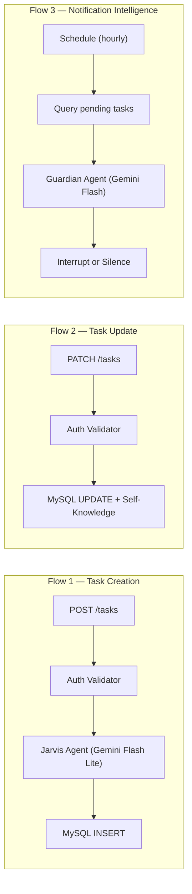

# Architecture — Jarvis

## HLD — High-Level Design

The system has 3 layers:

```
┌─────────────────┐     ┌───────────────────────────┐     ┌───────────────┐
│   Frontend      │────▶│  n8n (Docker/AWS EC2)     │────▶│    MySQL      │
│   (React/Vite)  │     │  REST API (Webhooks)      │     │   (RDS)       │
└─────────────────┘     │  ├─ Jarvis Agent           │     └───────────────┘
                        │  └─ Guardian Agent          │
                        └───────────────────────────┘
                                    │
                            AWS Cognito (JWT)
```

**Frontend** → Communicates via REST API (webhooks) with JWT authentication  
**n8n** → Orchestrates 3 independent flows, each with its own trigger  
**MySQL** → Stores tasks, status, metadata, and self-knowledge data

## MLD — Medium-Level Design

### 3 Independent Flows



### Auto-generated fields (Task Creation)

| Field | Description |
|-------|------------|
| `title` | Extracted from natural language |
| `contexto` | Work / Home / Health / Personal |
| `tag` | Deep Focus / Urgent / Social / Creative |
| `categoria` | Task / Idea / Habit |
| `prioridade` | low / medium / high |
| `nivel_energia` | low / medium / high |
| `duracao_estimada_minutos` | Integer |
| `notas` | Details + user commands |

### Session Memory

Both AI agents use **Buffer Window Memory**, maintaining context within a session:
- **Tasks Agent** — maintains current conversation context
- **Guardian Agent** — maintains history of recent decisions to avoid repetitive notifications

## LLD — Low-Level Design

> Note: The complete LLD depends on frontend and deployment infrastructure definitions that are still being finalized.

### Database Schema

See [Drizzle schema](../drizzle/schema.ts) for the complete TypeScript definition.

### System Prompts

See [docs/guardian-agent.md](./guardian-agent.md) for the Guardian Agent's system prompt.

**Jarvis — Tasks Agent:**
> You are Jarvis, a logical assistant for cognitive management. Your function is to transform speech into JSON for the database. Return ONLY the raw JSON with: title, contexto, tag, categoria, prioridade, nivel_energia, duracao_estimada_minutos, notas.

### n8n Workflow (JSON)

The exported workflow is available in the [`workflow/`](../workflow/) directory. It contains:
- 3 flows (Task Creation, Task Update, Notification Intelligence)
- 2 AI agents with configured system prompts
- 4 REST endpoints with authentication
- Session memory for both agents

To import: n8n → Settings → Import Workflow → paste JSON.

## Architecture Diagrams

| Diagram | Description |
|---------|------------|
| `assets/HLD_*` | High-Level Design — AWS infrastructure overview |
| `assets/MLD_*` | Medium-Level Design — Module decomposition and internal flows |
| `assets/LLD_*` | Low-Level Design — Node mapping (JSON-based) |
